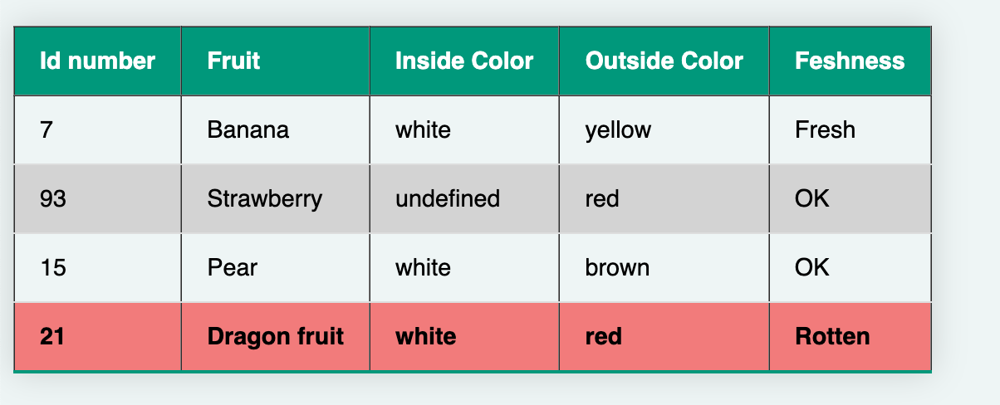

# Ruru templating system

A  very lightweight Javascript / HTML templating system inspired from my early days using Smarty templates for PHP.

If only I had something similiar that would run on an ESP32 server....

## Design goals

- Small code footprint to run on embeded systems.
- Less than 1K minified
- Fast.
- No external library dependancies.
- Templates should be pure HTML.
- Data source, simple Javascript object
- Support multidimensional data objects
- Same templates can run on browser of NodeJS backend
- Generate flat HTML for HTML email.
- Simple variable injection into template.
- Array/Object processing for tables / lists.
- No evals to stop injection attacks.

** HTML in email is challenging think of 15 year old standards

## Examples
All examples using the following Javascript object which could be loaded statically or dynamically over websockts / MQTT etc

```Javascript
fruitData = {
    bowlType:"ceramic",
    color: "white",
    fruits: [
        {id:7,name:"Banana",color:{inside:"white",outside:"yellow"},freshness:"Fresh"},
        {id:93,name:"Strawberry",color:{outside:"red"},freshness:"OK"},
        {id:15,name:"Pear",color:{inside:"white",outside:"brown"},freshness:"OK"},
        {id:21,name:"Dragon fruit",color:{inside:"white",outside:"red"},freshness:"Rotten"}
    ]
};
```

### #1 Simple substition
Templates are stored / hidden in HTML source code using the HTML5 template tag, don't forget to give the template an ID so you can refernce it;

Sample template
```HTML
<div id="myOutput"></div>
<template id="myTemplate">
    <span>Bowl is ${bowlType}, and it's color is ${color} containing ${fruits.length} items.</span>
</template>
```

Process the temoplate in Javascript
```Javascript
templateProcess("myTemplate","myOutput",fruitData);

```

Which will generate and insert the following.
```HTML
<span>Bowl is ceramic, and it's color is white containing 4 items.</span>

```

### #2 Handling missing data / defaults
Missing data references will gracefully return undefined. Option to use the pipe | to specify a default value.
Example template
```HTML
 <span>Error handling undefined var: "${blah.xx}", Undefined var with default:"${blah.xx|*my_default*}"</span>
```
Returns
```HTML
<span>Error handling undefined var: "undefined", Undefined var with default:"*my_default*"</span>
```

### #3 Processing a list / table

We use HTML comment blocks to insert a for each loop, this is to stop the DOM re ordering the source.

 ```<!--ForEach fruit in fruits  -->```
 
 Iterate over "fruits" in list replacing with fruit, similiar to Javascript ForEach.

```HTML
<template id="template1">
<table border="1">
    <thead>
        <tr>
            <th>Id number</th>
            <th>Fruit</th>
            <th>Inside Color</th>
            <th>Outside Color</th>
            <th>Feshness</th>
        </tr>
    </thead>
    <tbody>
<!--ForEach fruit in fruits  -->
        <tr id="fruitId-${fruit.id}" data-freshness="${fruit.freshness}">
            <td>${fruit.id}</td>
            <td>${fruit.name}</td>
            <td>${fruit.color.inside}</td>
            <td>${fruit.color.outside|none}</td>
            <td>${fruit.freshness}</td>
        </tr>
<!--/ForEach  -->
    </tbody>
</table>
</template>
```

Output sytlised with CSS


To run these examples you only need three files;
 - index.html
 - ruru_template.js
 - template.css

 Enjoy, Matt Way November 2024

